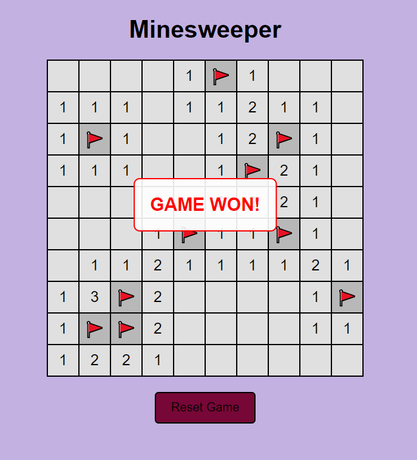

# Minesweeper Game
A simple Minesweeper game, on a 10x10 grid using JavaScript, HTML and CSS

# Features 
- A Reset Button to restart the Game
- 10 hidden mines to find and 10 flags to help uncovering the rest of the board
- left click reveals a cell
- right click flags/deflags a cell

# Screenshots

