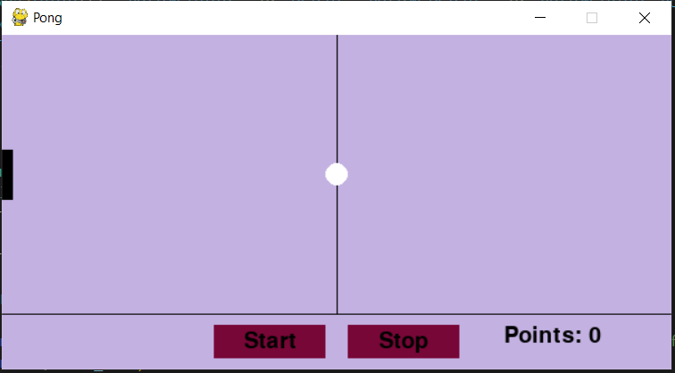
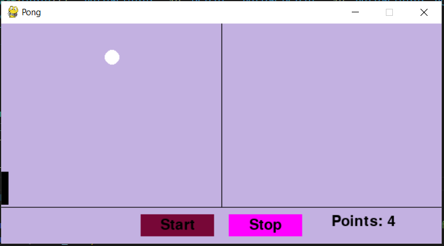

# Pong Game
A simple Pong game using Pygame

# Features
- Single-player Pong game
- Smooth paddle control using mouse 
- Tracks player scores
- Start/Stop button for gameplay control
- Buttons change color when the mouse hovers over them

# Screenshots

