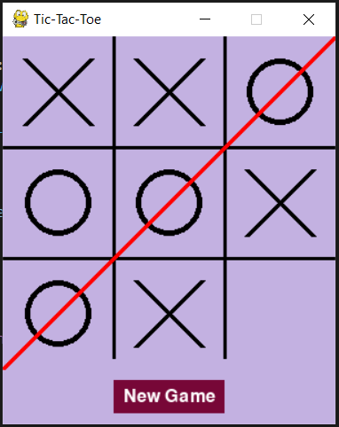

# Tic Tac Toe Game
A simple Tic Tac Toe game build wiht Python using Pygame.

## Features 
- A 3x3 grid to be filled with X and O using left mouse click
- Red line when either X or O wins
- New Game button to refresh and start over

## Screenshots 

